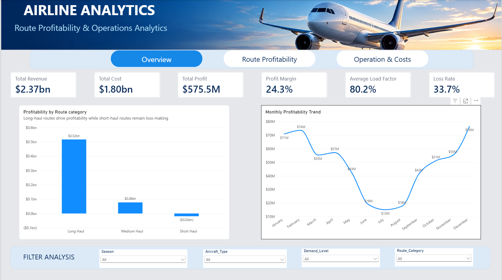
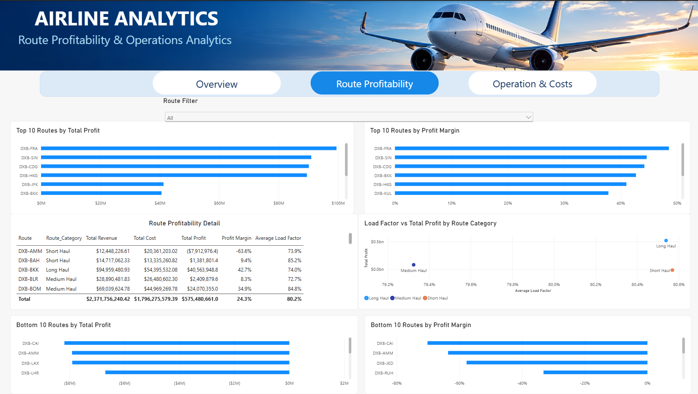
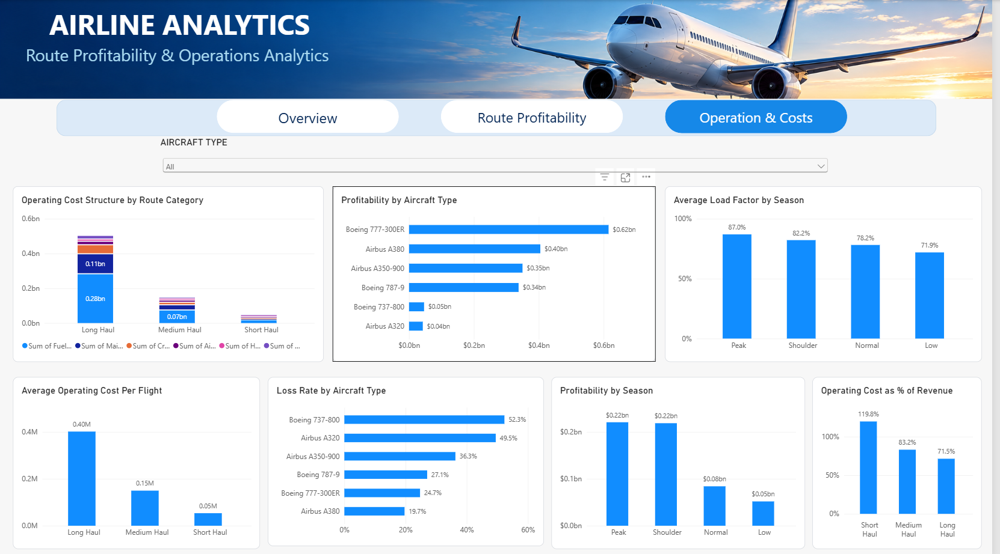

# Airline Route Profitability & Operations Analytics

## Project Overview

This project analyzes airline route profitability and operational performance using Excel, MySQL, and Power BI.

The goal was to understand how route characteristics, passenger demand, aircraft utilization, operating costs, fleet allocation, and seasonality affect profitability.

The analysis covers 7,974 flight records and follows a complete analytics workflow:

**Raw Data → Data Audit & Cleaning → SQL Analysis → Power BI Dashboard → Business Insights → Recommendations**

Rather than focusing only on which routes were profitable, the project investigates why performance differed across routes and operational conditions.

## Business Problem

Airline profitability is influenced by more than passenger volume. Route characteristics, aircraft deployment, operating costs, demand levels, and seasonality can all affect whether a flight generates or destroys value.

The objective of this project was to evaluate the financial and operational performance of an airline's route network and identify the factors associated with differences in profitability.

The analysis focused on answering the following business questions:

- Which routes generate the highest and lowest profits and profit margins?
- How does profitability differ across short-, medium-, and long-haul routes?
- Are loss-making routes primarily associated with low passenger utilization, or are other factors involved?
- Which operating costs have the greatest impact on route economics?
- How does aircraft type and deployment relate to profitability and loss rates?
- How do demand levels and seasonality affect load factor and profitability?
- Where are the largest concentrations of financial losses?
- What operational or commercial areas could management investigate to improve route performance?

## Dataset Overview

The dataset contains 7,974 flight-level records representing operations from Dubai (DXB) across multiple destinations.

The original dataset contains 33 fields covering:

- Flight and route information
- Aircraft type and capacity
- Passenger volume and load factor
- Route category and demand level
- Ticket and ancillary revenue
- Operating cost components
- Total revenue and total cost
- Profit and profit margin
- Seasonality

The dataset includes short-, medium-, and long-haul routes operated using six aircraft types.

### Data Quality Issues Identified

During the initial audit, the dataset contained 792 missing values across three financial fields:

| Field | Missing Values |
|---|---:|
| Ancillary Revenue | 271 |
| Catering Cost | 265 |
| Handling Cost | 256 |
| **Total** | **792** |

No duplicate records were identified.

Missing financial values were investigated rather than automatically treated as zero. Where the underlying accounting relationships supported reconstruction, missing values were derived from the corresponding revenue or cost components.

## Data Audit & Cleaning

Before performing the analysis, the dataset was audited in Excel to verify the reliability of key financial and operational fields.

### Validation Checks

Temporary validation columns were created to test:

- Revenue consistency
- Profit calculation
- Load factor
- Profit margin
- Origin consistency
- Route construction
- Season classification

Origin, route, profit margin, and season classification were validated against their expected relationships.

Load factor was recalculated as:

**Passengers ÷ Aircraft Capacity**

Small differences were observed between the recalculated and recorded load factors. Investigation showed that these differences were consistent with rounding in the recorded values. A tolerance of **0.006** was therefore used for the final validation rather than requiring an exact match.

### Missing Value Treatment

Missing values were not automatically replaced with zero.

For missing **Ancillary Revenue**, the value was reconstructed using:

**Ancillary Revenue = Total Revenue − Ticket Revenue**

For missing **Catering Cost** and **Handling Cost**, the missing component was derived from Total Cost after accounting for the remaining recorded cost components.

All 792 originally missing financial values were resolved using these accounting relationships.

### Duplicate Check

The 33 original dataset fields were checked for duplicate records. No duplicate rows were identified.

## Analysis Methodology

After cleaning and validating the dataset in Excel, the analysis was continued in MySQL and Power BI.

### Excel — Data Audit & Preparation

Excel was used to:

- Inspect the structure and quality of the raw dataset
- Validate key financial and operational calculations
- Investigate missing values and inconsistencies
- Reconstruct missing financial values where supported by the underlying accounting relationships
- Prepare a cleaned dataset for further analysis

### MySQL — Exploratory & Business Analysis

The cleaned dataset was imported into MySQL for deeper analysis.

SQL was used to investigate:

- Overall financial and operational performance
- Route-level profitability
- Profitability by route category
- Demand and passenger utilization
- Operating cost structure
- Aircraft performance and fleet allocation
- Seasonal performance
- Loss-making flights and routes
- Ancillary revenue contribution

### Power BI — Data Visualization

Power BI was used to transform the analysis into an interactive three-page dashboard:

1. **Overview** — headline financial and operational KPIs and overall profitability trends
2. **Route Profitability** — route-level performance, top and bottom performers, margins, and load factor
3. **Operations & Costs** — cost structure, aircraft performance, loss rates, and seasonality

## Key Findings

### 1. Overall Performance

Across 7,974 flights, the airline generated:

- **$2.37B** in total revenue
- **$1.80B** in total operating costs
- **$575.48M** in net profit
- **24.26%** overall profit margin
- **80.16%** average load factor

However, **2,688 flights were loss-making**, representing **33.71% of all flights**.

### 2. Short-Haul Operations Were the Main Profitability Concern

Profitability differed significantly by route category:

| Route Category | Flights | Total Profit | Profit Margin | Loss Rate |
|---|---:|---:|---:|---:|
| Long Haul | 3,225 | $51.73M | 28.53% | 19.47% |
| Medium Haul | 2,563 | $7.75M | 16.81% | 25.24% |
| Short Haul | 2,186 | -$19.33M | -19.81% | 64.64% |

Short-haul flights recorded an average load factor of approximately **80.6%**, similar to long-haul flights at approximately **80.5%**. This indicates that low passenger utilization alone does not explain the poor short-haul profitability.

### 3. Short-Haul Routes Faced Greater Cost Pressure

Airport fees and handling costs consumed a substantially larger share of short-haul revenue:

| Cost Component | Long Haul | Medium Haul | Short Haul |
|---|---:|---:|---:|
| Airport Fees | 1.11% | 2.72% | 7.84% |
| Handling Cost | 0.71% | 2.22% | 8.87% |

This suggests that relatively fixed ground and airport-related costs place greater pressure on routes generating lower revenue per flight.

### 4. Aircraft Performance Varied Significantly

The **Airbus A380** recorded the highest overall profit margin at **30.91%**, while the **Boeing 777-300ER** generated the highest total profit.

At the lower end, the **Boeing 737-800** and **Airbus A320** recorded overall profit margins of approximately **2.19%** and **4.60%**, respectively.

Aircraft performance also varied depending on route category, suggesting that fleet deployment should be considered alongside aircraft-level profitability.

### 5. Seasonality Had a Clear Relationship With Performance

| Season | Average Load Factor | Profit Margin |
|---|---:|---:|
| Peak | 86.99% | 31.91% |
| Shoulder | 82.20% | 26.44% |
| Normal | 78.17% | 22.43% |
| Low | 71.93% | 10.85% |

Both passenger utilization and profitability declined from Peak to Low season, highlighting the importance of seasonal demand in route performance.

### 6. Loss-Making Flights Created Material Profit Leakage

Loss-making flights generated approximately **-$92.69M** in losses, while profitable flights generated approximately **$668.17M** in positive profit.

The losses therefore offset approximately **13.9%** of the profit generated by profitable flights.

This highlights the potential financial impact of identifying and addressing persistently underperforming routes and operating conditions.

## Business Recommendations

Based on the findings from the analysis, the following areas should be prioritized for further management investigation:

### 1. Review Underperforming Short-Haul Routes

Short-haul operations recorded a negative overall profit margin and the highest loss rate despite maintaining relatively strong passenger utilization.

Management should review persistently loss-making short-haul routes individually to determine whether pricing, frequency, scheduling, or route continuation should be adjusted.

### 2. Investigate Airport and Ground-Handling Costs

Airport fees and handling costs consume a significantly larger proportion of short-haul revenue than they do on medium- and long-haul routes.

The airline should investigate opportunities to renegotiate supplier and airport agreements, improve ground-handling efficiency, or reconsider route economics where these costs consistently outweigh the revenue potential.

### 3. Review Aircraft-to-Route Allocation

Aircraft profitability varied substantially, and some aircraft types performed differently depending on the route category in which they were deployed.

Fleet allocation should therefore be evaluated at the route level rather than assessing aircraft performance in isolation. Further operational analysis could determine whether aircraft capacity and operating characteristics are appropriately matched to route demand and economics.

### 4. Strengthen Low-Season Capacity Planning

Low season recorded the lowest average load factor and profit margin.

Management should consider aligning capacity and flight frequency more closely with seasonal demand while evaluating targeted commercial strategies to improve utilization during weaker periods.

### 5. Prioritize High-Loss Routes for Detailed Review

A relatively large share of flights operated at a loss, reducing the profit generated by profitable operations.

Routes with persistent losses should be prioritized for deeper review of pricing, cost structure, aircraft assignment, frequency, and strategic importance before decisions are made regarding corrective action.

### 6. Avoid Using Load Factor as a Standalone Measure of Route Success

The short-haul analysis demonstrated that relatively high passenger utilization does not necessarily translate into profitability.

Route performance decisions should therefore combine operational KPIs such as load factor with revenue, cost, margin, and loss-rate measures.

## Power BI Dashboard

The final Power BI dashboard was designed across three pages to provide both executive-level monitoring and deeper analysis of route profitability and operational performance.

### Overview

The Overview page presents the airline's headline financial and operational KPIs, including total revenue, total cost, total profit, overall profit margin, average load factor, and loss rate.



### Route Profitability

The Route Profitability page provides deeper route-level analysis, including top and bottom performing routes, profit margins, load factor, and detailed route performance.



### Operations & Costs

The Operations & Costs page examines operating cost structure, aircraft profitability, aircraft loss rates, seasonal performance, and operating cost as a percentage of revenue.



## Limitations & Disclosure

This project was developed as a portfolio analysis using the information available in the dataset. The findings should therefore be interpreted within the following limitations:

- The dataset contained 7,974 records and 33 original fields. Any differences between these figures and the original dataset description reflect the structure of the file actually analyzed.

- The original dataset contained 792 missing values across Ancillary Revenue, Catering Cost, and Handling Cost. These values were reconstructed only where the underlying revenue and cost relationships provided a basis for doing so.

- Load factor was independently recalculated as Passengers ÷ Aircraft Capacity. Small differences were observed between the recalculated and recorded values, consistent with rounding in the source data. A tolerance of 0.006 was used during final validation.

- Profitability findings describe relationships observed within this dataset. They should not be interpreted as evidence that a particular operational factor directly caused profitability or losses.

- The analysis does not include additional commercial or operational context that may influence real airline decisions, such as competitive conditions, airport slot constraints, network connectivity, regulatory requirements, or strategic route importance.

- Business recommendations should therefore be treated as areas for further investigation rather than automatic operational decisions.

## Repository Structure

```text
airline-route-profitability-analysis/
│
├── dashboard/
│   ├── README.md
│   ├── Overview.png
│   ├── route_profitability.png
│   └── Operations_costs.png
│
├── data/
│   └── README.md
│
├── sql/
│   ├── README.md
│   └── airline_analysis.sql
│
└── README.md


The original and cleaned datasets are not currently redistributed in this repository pending confirmation of the source dataset's licensing and redistribution terms.
